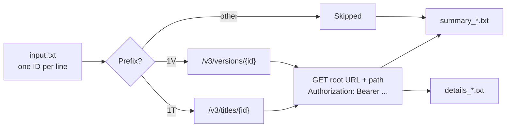

<div align="center">

# API ID Status Checker

**A local-only FastAPI utility that checks a list of title and version IDs against your API and produces a clean result list plus a full audit log.**

[](https://www.python.org/)
[](https://fastapi.tiangolo.com/)
[](#tests)
[](#run-the-macos-app)

</div>

---

Put one ID per line in `input.txt`, point the app at your API root, and press
**Start API check**. Each ID is routed to the matching endpoint, requested
sequentially with a bearer token, and recorded in two timestamped files:

| File | Contents |
| --- | --- |
| `summary_*.txt` | One result line per input ID, plus run totals |
| `details_*.txt` | Sanitized request, response status, headers, body, and timing for every call |

Everything runs on `127.0.0.1`. The token is held in memory for the duration of
the run and is never written to a log or a URL.

## Contents

- [Features](#features)
- [How it works](#how-it-works)
- [Quick start](#quick-start)
- [Using the app](#using-the-app)
- [Configuration reference](#configuration-reference)
- [Output files](#output-files)
- [HTTP API reference](#http-api-reference)
- [Project layout](#project-layout)
- [Development](#development)
- [Run the macOS app](#run-the-macos-app)
- [Security and privacy](#security-and-privacy)
- [Troubleshooting](#troubleshooting)

## Features

- **Prefix-based routing** — `1T` IDs go to the title endpoint, `1V` IDs to the
  version endpoint. Both path templates are editable in the form.
- **Live progress** — the page polls twice a second and shows counts for OK,
  not found, errors, and skipped IDs while the run is in flight.
- **Two output files per run** — a scannable summary and a complete
  request/response log, both downloadable from the page.
- **Secrets stay out of the logs** — the bearer token, `Authorization`,
  `Cookie`, `Set-Cookie`, `Proxy-Authorization`, and `X-API-Key` values are
  replaced with `<redacted>` everywhere they appear.
- **Strict input validation** — the root URL and both path templates are
  checked for credentials, query strings, fragments, traversal segments, and
  percent-encoding tricks before any request is sent.
- **Runs offline and locally** — binds only to the loopback interface, and
  output files are created with owner-only permissions.
- **Double-clickable macOS build** — one script produces an ad-hoc signed
  `.app` that starts the server and opens the browser for you.

## How it works



Requests are issued one at a time, in file order, with a configurable pause
between them. Redirects are not followed.

## Quick start

Python **3.11 or newer** is required; **3.13** is recommended and is what the
macOS build uses.

```bash
git clone https://github.com/yashraj-joshi/viraj_app.git
cd viraj_app

python3 -m venv .venv
source .venv/bin/activate
python -m pip install -r requirements-dev.txt

uvicorn app:app --host 127.0.0.1 --port 8000
```

Open <http://127.0.0.1:8000>.

> [!TIP]
> Prefer the double-clickable build? See [Run the macOS app](#run-the-macos-app).

### Requirement files

| File | Use |
| --- | --- |
| `requirements.txt` | Runtime only — FastAPI, httpx, uvicorn |
| `requirements-dev.txt` | Runtime plus pytest |
| `requirements-build.txt` | Runtime plus PyInstaller and Pillow, for packaging |

## Using the app

1. **Edit `input.txt`.** Replace the sample values with the real IDs, one per
   line. Blank lines are ignored and surrounding whitespace is trimmed.
2. **Enter the root API URL**, for example `https://api.example.com`. Trailing
   slashes are removed before the path is appended.
3. **Review the `1T` and `1V` path templates.** The two preview cards at the top
   of the page show the exact URL each prefix will request.
4. **Paste the bearer token** into the password-style field.
5. *(Optional)* Open **Request timing** to change the delay between calls or the
   per-request timeout.
6. **Start the check.** The page shows live progress and per-status counts.
7. **Download the summary and detailed log** when the run completes. Copies also
   remain in the local `outputs/` directory.

## Configuration reference

### Input file

`input.txt` sits beside the application and holds one ID per line. It is read as
UTF-8 (a byte-order mark is tolerated). Blank lines are skipped. The packaged
app creates the file with two sample IDs if it is missing.

### Routing

| ID prefix | Default path template |
| --- | --- |
| `1T` | `/v3/titles/{id}` |
| `1V` | `/v3/versions/{id}` |

The prefix check is **case-sensitive**. IDs with any other prefix are recorded
as skipped and do not result in an API call.

Both templates are editable in the form and must:

- begin with exactly one `/` (not `//`),
- contain `{id}` exactly once, and
- contain no whitespace, backslashes, query string, fragment, `.`/`..`
  segments, or encoded forms of any of those.

The placeholder may be a whole path segment, as in `/v3/titles/{id}`, or part of
one, as in `/v1/titles/OTP:{id}`. Path case is preserved and may matter to your
server. The root URL and the selected path are joined with exactly one slash,
and the ID is percent-encoded before it replaces `{id}`.

### Authentication

Enter the access token in the **Bearer token** field. Every request sends it as:

```text
Authorization: Bearer <token>
```

A pasted `Bearer ` prefix is accepted and normalized. The app does **not**
support Basic authentication, client ID / client secret exchanges, OAuth token
acquisition, or unauthenticated requests.

### Request timing

| Setting | Default | Allowed range |
| --- | --- | --- |
| Delay between calls | 0.2 s | 0 – 30 s |
| Request timeout | 30 s | 1 – 300 s |

## Output files

Each run writes two files into `outputs/`, named with the run's UTC start time
and the first eight characters of the job ID:

```text
outputs/summary_20260922_143001_7f3a9c21.txt
outputs/details_20260922_143001_7f3a9c21.txt
```

Both begin with a header recording the job ID, start time, root URL, both path
templates, timeout, delay, and input count.

### Result statuses

| HTTP result | Recorded as |
| --- | --- |
| Exactly `200` | `OK` |
| `404` | `NOT FOUND` |
| Any other status | `ERROR` |
| Network, timeout, DNS, or TLS failure | `REQUEST ERROR` |
| Unsupported ID prefix | `SKIPPED` |

Redirects are not followed, so a `3xx` response is recorded as an error.

### Response bodies in the detailed log

Textual bodies — `text/*`, JSON, XML, JavaScript, and form-encoded — are logged
up to **200,000 characters**. Longer bodies are truncated with a note giving the
number of omitted characters. Binary bodies are recorded by size only, without
dumping their bytes.

## HTTP API reference

The browser page is a client of this API. Interactive documentation is available
at `/docs` while the server is running.

| Method | Path | Purpose |
| --- | --- | --- |
| `GET` | `/` | The single-page form |
| `GET` | `/health` | Liveness probe, used by the launcher |
| `GET` | `/api/runtime` | Whether the app is packaged, its data directory, and whether it can self-quit |
| `GET` | `/api/input-preview` | Path, count, per-prefix totals, and first five IDs from `input.txt` |
| `POST` | `/api/jobs` | Validate the form, start a run, return the initial job state (`202`) |
| `GET` | `/api/jobs/{job_id}` | Poll job status, counts, and download URLs |
| `GET` | `/api/jobs/{job_id}/files/summary` | Download the summary file |
| `GET` | `/api/jobs/{job_id}/files/details` | Download the detailed log |
| `POST` | `/api/shutdown` | Stop the server — packaged app only, otherwise `404` |

> [!NOTE]
> Job state lives in memory. Restarting the server clears the job list, though
> the files already written to `outputs/` remain on disk.

## Project layout

```text
viraj_app/
├── app.py                  # FastAPI app: validation, job runner, routes
├── mac_app_launcher.py     # Packaged-app entry point: port binding, browser, quit
├── build_macos_app.sh      # Repeatable PyInstaller build
├── packaging/make_icon.py  # Generates AppIcon.icns for the build
├── templates/index.html    # Single-page UI
├── static/                 # app.js and styles.css
├── tests/test_app.py       # Test suite
├── input.txt               # Your IDs, one per line
└── outputs/                # Generated summary_*.txt and details_*.txt (git-ignored)
```

## Development

### Tests

```bash
source .venv/bin/activate
pytest -q
```

`pytest.ini` sets `pythonpath = .` and `testpaths = tests`, so the command works
from the project root with no extra flags.

### Debugging in VS Code

The bundled **Debug FastAPI on port 8001** launch configuration starts uvicorn
with `--reload` on port 8001, so it can run alongside a server already using
port 8000.

### Rebuild the macOS application

The build script creates an Apple Silicon `.app` using Python 3.13 and
PyInstaller:

```bash
./build_macos_app.sh
```

Set `PYTHON_313` if your interpreter is not at
`/opt/homebrew/bin/python3.13`:

```bash
PYTHON_313=/usr/local/bin/python3.13 ./build_macos_app.sh
```

The script builds in a temporary directory, copies the finished
`API ID Status Checker.app` into the project folder, stamps the version and
minimum system version into `Info.plist`, and ad-hoc signs the bundle.

## Run the macOS app

The packaged Finder application is `API ID Status Checker.app`.

Keep the application, `input.txt`, and the `outputs/` folder together in the
same folder, then double-click the application. It starts a private server on
`127.0.0.1` and opens the form in your default browser.

- If port 8000 is occupied, the app automatically picks another free local port.
- Closing the browser does **not** stop the app. Use the **Quit application**
  button on the page, or quit **API ID Status Checker** from the Dock or
  Activity Monitor.
- Set `API_CHECKER_NO_BROWSER=1` to start the server without opening a browser.

This build targets Apple Silicon Macs running macOS 11 or newer. It is ad-hoc
signed but **not notarized**, so it is intended for the machine that built it
rather than for distribution.

## Security and privacy

- The server binds only to `127.0.0.1`; nothing is exposed on the network.
- The token is kept in memory only while the job runs, is cleared from the
  browser form once the job starts, is never placed in a request URL, and is
  never persisted by the application.
- The token — and its percent-encoded form — are redacted from every line of
  both output files, including error messages and response bodies.
- Sensitive headers are redacted by name: `Authorization`, `Cookie`,
  `Set-Cookie`, `Proxy-Authorization`, and `X-API-Key`.
- Output files are created exclusively (never overwriting an existing file) with
  owner-only `0600` permissions.
- The root URL must use HTTP or HTTPS and may not contain embedded credentials,
  query parameters, or a fragment.
- `outputs/` is git-ignored, so results are not committed by accident.

## Troubleshooting

| Symptom | Cause and fix |
| --- | --- |
| `input.txt was not found beside the application.` | Move `input.txt` next to the `.app` (or into the project root when running from source). |
| `input.txt contains no IDs.` | Every line was blank. Add one ID per line. |
| All IDs report `SKIPPED` | The prefix check is case-sensitive — IDs must start with `1T` or `1V`, not `1t` or `1v`. |
| Everything returns `REQUEST ERROR` | Check the root URL host, your network or VPN, and whether the API is reachable over TLS. |
| Results are `ERROR (301 Moved Permanently)` | Redirects are not followed by design. Point the root URL at the final location. |
| The app opens no browser window | Try <http://127.0.0.1:8000> by hand; if that port was taken the app picked another one. If nothing responds, check `launcher_error.txt` beside the app for the startup failure. |
| Port 8000 already in use | The packaged app falls back to a free port automatically. From source, pass a different `--port`. |
